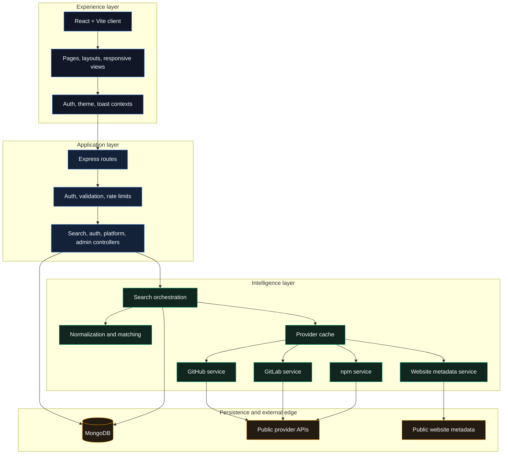

# Social Media Finder

<p align="center">
  
  
  
  
</p>

<p align="center">
  <strong>Find. Connect. Understand.</strong><br />
  A privacy-first developer identity discovery platform for public technical signals.
</p>

<p align="center">
  <a href="https://social-media-finder-ruddy.vercel.app/">Live deployment</a>
  &nbsp;&bull;&nbsp;
  <a href="https://github.com/dipeshgirase12-ai/Social-Media-Finder">Repository</a>
  &nbsp;&bull;&nbsp;
  <a href="http://localhost:5173">Local preview</a>
  &nbsp;&bull;&nbsp;
  <a href="#quick-start">Quick start</a>
</p>

---

## Product overview

Social Media Finder, internally branded as **DevTrace**, brings scattered public developer signals into one focused workspace. Search by name, username, or GitHub URL and inspect profiles, repositories, packages, websites, and cross-platform relationships without crossing privacy boundaries.

The interface is designed as a high-contrast developer tool: matte surfaces, crisp borders, explainable confidence scores, responsive layouts, and a relationship graph that makes connections easier to inspect.

### What it helps with

| Workflow | Result |
| --- | --- |
| Developer discovery | Search public identities across supported platforms |
| Technical research | Inspect repositories, package activity, and website metadata |
| Identity matching | Compare public signals with visible evidence and confidence scores |
| Recruiting and networking | Save profiles, revisit history, and export search results |
| Platform monitoring | See provider availability, status, and fallback behavior |

## Feature set

### Discovery and enrichment

- GitHub user, profile, repository, and repository-health discovery
- GitLab user discovery
- npm public package search
- Website metadata, favicon, preview image, and public link extraction
- External-search fallback labels for LinkedIn, Instagram, X, and Medium
- Demo mode for local exploration without provider credentials

### Explainable matching

- Cross-platform similarity scoring based on public signals
- Match evidence displayed alongside confidence levels
- Normalized names, usernames, URLs, and provider data
- Relationship graph for connected identities and sources

### Workspace features

- JWT-backed registration, login, logout, and current-user sessions
- Saved profiles and search history
- JSON and CSV export flows
- Responsive dashboard, search, profile, repository, history, and admin views
- Light and dark themes with dark mode as the first-visit default

### Operational safeguards

- Zod request validation
- Centralized async error handling
- Helmet security headers and CORS configuration
- Search and API rate limiting
- Provider response caching
- Structured request logging
- MongoDB persistence through Mongoose

---

## System architecture

The application is organized as a layered pipeline. The frontend owns the experience, the API owns orchestration and policy, provider services own external integrations, and MongoDB owns durable user data.



### Request lifecycle

```text
1. User submits a public search from the React client.
2. The API validates the request and checks authentication and rate limits.
3. Search orchestration normalizes the input and checks cached provider data.
4. Provider services query official public APIs or public website metadata.
5. Matching services compare normalized public signals and produce evidence.
6. The API returns a structured result for cards, charts, and the relationship graph.
7. Authenticated searches and saved profiles are persisted in MongoDB.
```

## Technology stack

### Client

- React 18 and TypeScript
- Vite for local development and production bundling
- Tailwind CSS for the design system
- Framer Motion for restrained interaction motion
- Recharts for skill and repository visualizations
- React Router for application navigation
- Vitest and Testing Library for UI tests

### Server

- Node.js 18+ and Express
- TypeScript with strict compilation
- MongoDB and Mongoose
- JWT and bcrypt-based authentication
- Zod request schemas
- Cheerio for public website metadata extraction
- Vitest and Supertest for API tests

## Repository structure

```text
.
|-- client/
|   |-- public/                 Static assets and robots.txt
|   |-- src/
|   |   |-- components/         Layout, search, profile, repo, graph, and UI
|   |   |-- context/            Authentication, theme, and toast state
|   |   |-- hooks/              Reusable client hooks
|   |   |-- lib/                API and formatting helpers
|   |   |-- pages/              Route-level views
|   |   |-- types/              Shared client types
|   |   `-- tests/              Component and interaction tests
|   |-- index.html
|   |-- tailwind.config.ts
|   `-- vite.config.ts
|-- server/
|   |-- src/
|   |   |-- config/             Environment and database configuration
|   |   |-- controllers/        Request handlers
|   |   |-- middleware/         Auth, errors, limits, and logging
|   |   |-- models/             Mongoose persistence models
|   |   |-- routes/             API route registration
|   |   |-- services/            Search, matching, and provider integrations
|   |   |-- utils/              Cache, normalization, similarity, and errors
|   |   |-- validation/         Zod schemas
|   |   `-- tests/              Server integration and unit tests
|   |-- package.json
|   `-- tsconfig.json
|-- docker/
|   `-- Dockerfile.server
|-- docker-compose.yml
|-- render.yaml
|-- package.json
`-- README.md
```

## Quick start

### Requirements

- Node.js 18 or newer
- MongoDB locally or a MongoDB Atlas connection
- Git

### Install

```bash
npm install
npm run install:all
```

### Configure the server

Create `server/.env` from the project environment template when available, then set the required values:

```env
PORT=5000
NODE_ENV=development
MONGODB_URI=mongodb://127.0.0.1:27017/devtrace
JWT_SECRET=replace-with-a-long-random-secret
CLIENT_URL=http://localhost:5173
DEMO_MODE=false
ADMIN_EMAILS=you@example.com
```

Set `DEMO_MODE=true` when you want to explore the interface without configuring external provider credentials. Demo responses remain clearly labeled as synthetic data.

### Run locally

```bash
npm run dev
```

Open the client at [http://localhost:5173](http://localhost:5173). The API runs at [http://localhost:5000](http://localhost:5000).

## Commands

```bash
# Run client and server together
npm run dev

# Build both applications
npm run build

# Run all tests
npm run test

# Lint both applications
npm run lint

# Run one side independently
npm run dev:client
npm run dev:server
```

Client-specific commands:

```bash
npm --prefix client run typecheck
npm --prefix client run test -- --run
npm --prefix client run preview
```

Server-specific commands:

```bash
npm --prefix server run typecheck
npm --prefix server run test
npm --prefix server run start
```

## Environment variables

| Variable | Required | Description |
| --- | --- | --- |
| `MONGODB_URI` | Yes | MongoDB connection string |
| `JWT_SECRET` | Yes | Secret used to sign authentication tokens |
| `CLIENT_URL` | Yes | Frontend origin allowed by CORS |
| `GITHUB_TOKEN` | No | Optional GitHub quota increase |
| `GITLAB_TOKEN` | No | Optional GitLab quota increase |
| `NPM_API_URL` | No | Optional npm registry endpoint override |
| `DEMO_MODE` | No | Enables clearly labeled synthetic provider data |
| `ADMIN_EMAILS` | No | Comma-separated administrator email list |
| `SEARCH_RATE_LIMIT` | No | Search request limit per configured window |
| `CACHE_TTL_SECONDS` | No | Public provider cache duration |

## API surface

### Authentication

```text
POST /api/auth/register
POST /api/auth/login
POST /api/auth/logout
GET  /api/auth/me
```

### Search and history

```text
POST   /api/search
GET    /api/search/:id
GET    /api/search/history
DELETE /api/search/:id
DELETE /api/search/history
GET    /api/search/:id/export
```

### Saved profiles

```text
GET    /api/saved
POST   /api/saved
DELETE /api/saved/:platform/:username
```

### Provider and platform routes

```text
GET /api/github/users
GET /api/github/users/:username
GET /api/github/users/:username/repos
GET /api/github/repos/:owner/:repo
GET /api/gitlab/users/:username
GET /api/npm/search
GET /api/website/analyze
```

### Operations

```text
GET /api/health
GET /api/admin/stats
```

## Privacy and responsible use

Social Media Finder is intentionally limited to public information and public provider interfaces.

- No private accounts, private repositories, or hidden data are accessed.
- No authentication boundaries are bypassed.
- Platforms without an appropriate public API are labeled as external search.
- Match scores communicate confidence, not proof of identity.
- Repository and website signals are evidence, not guaranteed claims of expertise.
- Users should respect each provider's terms, quotas, and applicable laws.

## Docker and deployment

Run the API and MongoDB together with Docker Compose:

```bash
docker compose up --build
```

The repository also includes `render.yaml` and a server Dockerfile for container-oriented hosting. For production, configure a managed MongoDB instance, a strong unique `JWT_SECRET`, the exact deployed `CLIENT_URL`, HTTPS, and provider tokens only where they are needed.

### Vercel frontend

The Vercel configuration deploys the Vite client from `client/dist`. The Express API remains a separate service, configured by `render.yaml` or another Node-compatible host.

Live application: [social-media-finder-ruddy.vercel.app](https://social-media-finder-ruddy.vercel.app/)

In the Vercel project settings:

1. Keep the repository root as the project root.
2. Use the committed `vercel.json` build configuration.
3. Add `VITE_API_URL` with the deployed API origin, for example `https://your-api.example.com/api`.
4. Set the API service's `CLIENT_URL` to the deployed Vercel URL.

The local fallback remains `/api`, so the existing Vite development proxy continues to work without extra configuration.

## Verification

The project currently validates both layers independently:

- Server health, authentication, normalization, matching, rate limits, validation, and website metadata tests
- Client search, repository, and match-score component tests
- TypeScript compilation for client and server
- Production Vite build for the client

## License

This project is licensed under the MIT License.

## Acknowledgements

Built for transparent public developer discovery, technical research, and professional networking workflows.
# DevTrace

<p align="center">
  
  
  
</p>

<p align="center">
  <strong>Find. Connect. Understand.</strong>
</p>

DevTrace is a privacy-first public developer discovery platform built to help users explore public developer identities, repositories, packages, and website signals in a structured, explainable way.

This product is intentionally designed around public, verifiable information only. It does not scrape private accounts, bypass authentication boundaries, or make claims of identity certainty—it instead surfaces transparent evidence, confidence scoring, and discovery paths that are useful for research, hiring, networking, and technical exploration.

---

## Why DevTrace

Modern developer discovery is fragmented across GitHub, GitLab, npm, personal sites, and public social profiles. DevTrace brings those signals together into one coherent search experience with:

- GitHub and GitLab profile discovery
- Repository health and signal analysis
- npm package visibility
- Website metadata and preview extraction
- Cross-platform matching with explainable evidence
- Saved history and personal account experience
- Secure JWT-based session handling

---

## Core features

### Public discovery engine
- Search by developer name, username, or GitHub URL
- Public profile metadata aggregation from multiple platforms
- Repository discovery and quality signals
- Public website metadata extraction with favicon and preview support
- Safe external-search fallbacks for platforms without public APIs

### Explainable matching
- Cross-platform match scoring based on public signals
- Confidence labels and evidence summaries
- Human-readable metadata used in ranking and display

### Developer workflow tools
- Save favorite profiles
- View search history
- Export saved or historical search results
- Protected authenticated routes with session persistence
- Admin access support for designated addresses

### Production-ready backend
- Express API with validation and structured error handling
- MongoDB persistence for auth, history, and saved items
- Request rate limiting
- CORS and security headers
- In-memory caching strategy for public metadata

---

## Tech stack

### Frontend
- React 18
- Vite
- TypeScript
- Tailwind CSS
- Framer Motion
- Recharts
- React Router

### Backend
- Node.js
- Express
- TypeScript
- MongoDB + Mongoose
- JWT authentication
- Zod validation
- Cheerio-based public web scraping metadata extraction

---

## Project structure

```text
.
├── client/                     # React frontend
│   ├── src/
│   ├── public/
│   ├── package.json
│   ├── vite.config.ts
│   └── tailwind.config.ts
├── server/                     # Express backend
│   ├── src/
│   ├── tests/
│   ├── package.json
│   └── tsconfig.json
├── docker/
│   └── Dockerfile.server
├── package.json
├── docker-compose.yml
├── render.yaml
├── README.md
└── LICENSE
```

---

## Quick start

### Prerequisites
- Node.js 18+
- MongoDB running locally or a MongoDB Atlas connection

### 1) Install dependencies

```bash
npm install
npm --prefix server install
npm --prefix client install
```

You can also use:

```bash
npm run install:all
```

### 2) Configure environment

Copy the sample env file:

```bash
copy server\.env.example server\.env
```

Then update the values in `server/.env`:

```env
PORT=5000
NODE_ENV=development
MONGODB_URI=mongodb://127.0.0.1:27017/devtrace
JWT_SECRET=your-super-secret-jwt-key
CLIENT_URL=http://localhost:5173
DEMO_MODE=false
ADMIN_EMAILS=you@example.com
```

For a fully local startup, MongoDB must be available. If you want an immediate demo experience without provider credentials, set `DEMO_MODE=true`.

### 3) Run the app

```bash
npm run dev
```

Then open:

- Frontend: http://localhost:5173
- Backend: http://localhost:5000

> If 5173 is busy, Vite may use the next available port automatically.

---

## Useful commands

```bash
npm run dev
npm run build
npm run test
npm run lint
```

Single app commands:

```bash
npm --prefix server run dev
npm --prefix client run dev
npm --prefix server run test
npm --prefix client run build
```

---

## Environment variables

| Variable | Required | Purpose |
| --- | --- | --- |
| `MONGODB_URI` | Yes | MongoDB connection string |
| `JWT_SECRET` | Yes | Secret used to sign auth tokens |
| `CLIENT_URL` | Yes | Allowed frontend origin for CORS |
| `GITHUB_TOKEN` | No | Optional GitHub API quota boost |
| `GITLAB_TOKEN` | No | Optional GitLab API quota boost |
| `NPM_API_URL` | No | Override npm registry endpoint |
| `DEMO_MODE` | No | Returns clearly labelled synthetic data |
| `ADMIN_EMAILS` | No | Comma-separated admin list |
| `SEARCH_RATE_LIMIT` | No | Search rate limit per window |
| `CACHE_TTL_SECONDS` | No | Provider cache duration |

---

## API overview

### Auth
- `POST /api/auth/register`
- `POST /api/auth/login`
- `POST /api/auth/logout`
- `GET /api/auth/me`

### Search and discovery
- `POST /api/search`
- `GET /api/search/:id`
- `GET /api/search/history`
- `DELETE /api/search/:id`
- `DELETE /api/search/history`
- `GET /api/search/:id/export`

### Saved profiles
- `GET /api/saved`
- `POST /api/saved`
- `DELETE /api/saved/:platform/:username`

### Platform endpoints
- `GET /api/github/users`
- `GET /api/github/users/:username`
- `GET /api/github/users/:username/repos`
- `GET /api/github/repos/:owner/:repo`
- `GET /api/gitlab/users/:username`
- `GET /api/npm/search`
- `GET /api/website/analyze`

### Health and admin
- `GET /api/health`
- `GET /api/admin/stats`

---

## App behavior and privacy model

DevTrace is designed with a clear ethical and technical boundary:

- It uses only public information
- It does not access private or protected accounts
- It does not accept email addresses as identity search inputs
- Match scores are confidence markers, not definitive identity proof
- Repository and site signals are surfaced as evidence, not guaranteed expertise claims

This makes it suitable for discovery workflows, technical profiling, and networking research without crossing into invasive or private data collection.

---

## Deployment

### Docker

```bash
docker compose up --build
```

The Docker setup is ready for deployment in container-friendly environments such as Render, Railway, or similar hosts.

### Production hosting

For production deployments:
- set `MONGODB_URI`
- set a strong `JWT_SECRET`
- set `CLIENT_URL` to the exact frontend origin
- optionally set GitHub/GitLab tokens for higher quota
- enable HTTPS behind your hosting layer

---

## Testing

The project includes both backend and frontend tests:

```bash
npm --prefix server run test
npm --prefix client run test -- --run
```

The backend coverage includes:
- auth flow validation
- query normalization
- matching logic
- repository health scoring
- rate limiting
- validation contracts

---

## License

This project is licensed under the MIT License.

---

## Acknowledgements

Built for public developer discovery, technical research, and professional networking workflows.

If you want to raise the product further, the next strong additions are:
- Redis-backed caching
- richer AI-assisted search summaries
- better profile trust scoring
- richer admin dashboards
- automated deployment pipelines

